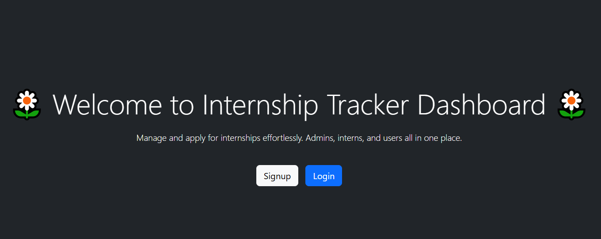
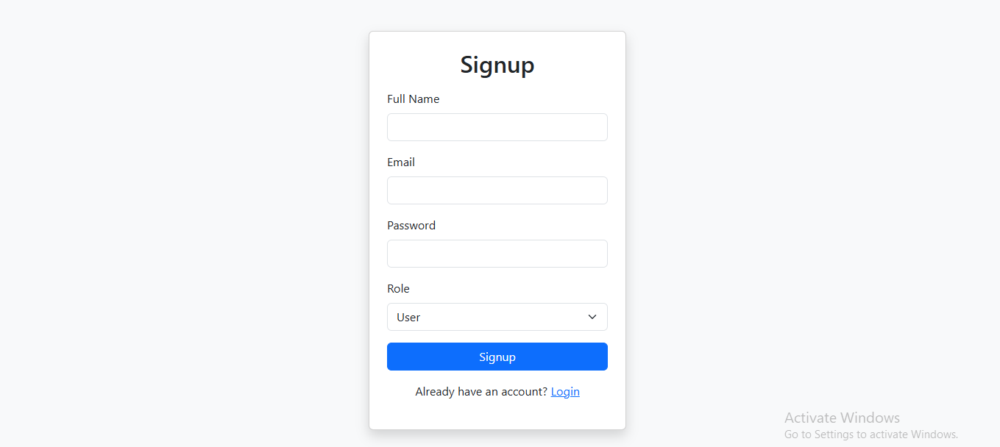
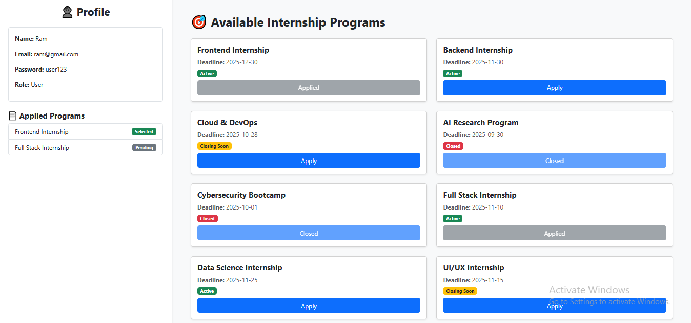
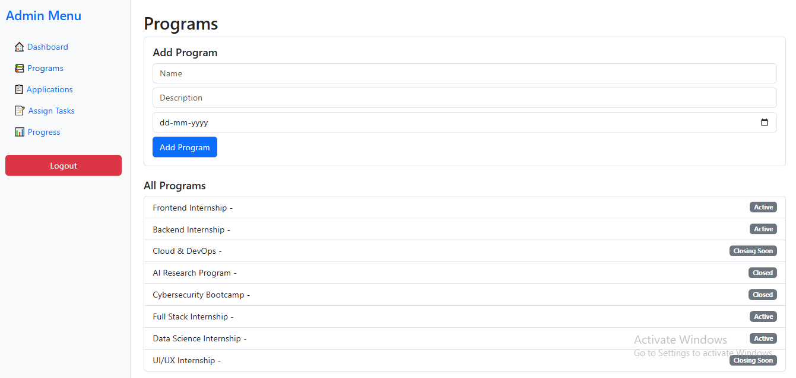

# Internship Tracker 🎯

> A platform to manage interns, tasks, and programs efficiently.

## 🚀 Features
- 👥 User, Admin, Intern roles
- 📅 Program management
- ✅ Task tracking & status updates

## ⚙️ Tech Stack
React | Express | LocalStorage | BootStrap

I didn't done with backend till now. I used localstorage to manage with data.I will get bact to u as soon as it completed..
and I will give u the live demo soon... 😉

## Screenshots
here are some of the outcomes of my project

# Welcome Page

# Login Page

# SignUp Page

# User Dashboard

# Add & view Internship Programs in Admin Pages

